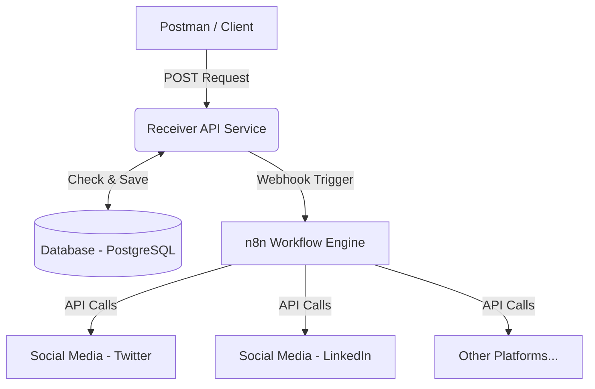

# High-Level Design (HLD) - Automated Social Media Posting System

## 1. Introduction
This document provides the High-Level Design for a system that receives information via an API (triggered by Postman), deduplicates it by storing it in a database, and forwards the unique data to n8n for further processing and automated posting to social media platforms.

## 2. System Architecture
The system follows a microservices-inspired workflow automation pattern. It consists of three main components:
1. **Receiver API Service:** A lightweight backend service (e.g., written in Golang, utilizing skills from the `skills` directory) to handle incoming data.
2. **Database:** A relational database (e.g., PostgreSQL) to persist incoming data and prevent duplicate entries.
3. **Workflow Automation (n8n):** The core logic engine that receives verified unique data and handles the integrations with target social platforms.

### Architecture Diagram

## 3. Component Details

### 3.1. Receiver API Service (Golang)
- **Role:** Entry point for the data.
- **Functions:**
  - Receives JSON payload from clients (e.g., Postman).
  - Validates the payload format.
  - Generates a unique hash/identifier for the payload to check against the Database.
  - If a duplicate is found, rejects the request or ignores it to prevent double posting.
  - If unique, saves the record to the Database and forwards the payload to the n8n Webhook URL.
- **Tech Stack:** Golang (Gin framework recommended per project skills).

### 3.2. Database (PostgreSQL)
- **Role:** Persistence and Deduplication.
- **Functions:**
  - Stores a history of all received valid payloads.
  - Uses unique constraints (e.g., on a `content_hash` or `message_id` column) to ensure idempotency.

### 3.3. n8n Workflow Automation
- **Role:** Processing and Integration.
- **Functions:**
  - Starts with a **Webhook Node** that listens for the Receiver API Service.
  - Optionally processes or formats the data using **Code Nodes** (JavaScript).
  - Uses **Social Media Nodes** (e.g., LinkedIn, Twitter/X, Facebook) to distribute the content.
  - Can include error handling to notify administrators if a post fails.

## 4. Data Flow

1. **Submission:** Postman sends a POST request with the social media content to the Receiver API Service.
2. **Validation & Deduplication:**
   - The Receiver API parses the request.
   - Queries the PostgreSQL DB: `SELECT id FROM posts WHERE content_hash = ?`
   - If exists -> Returns `200 OK` (or `409 Conflict`), stops processing.
3. **Storage:** If it does not exist, the Receiver API inserts the data into the DB.
4. **Forwarding:** The Receiver API makes an HTTP POST request to the n8n Webhook URL, passing the original content.
5. **n8n Processing:** n8n receives the webhook, formats the message, and makes API calls to the configured social media platforms.
6. **Completion:** Social media platforms return success responses to n8n, completing the workflow.

## 5. Security & Error Handling
- **API Authentication:** The Receiver API should be secured with an API Key or Bearer Token (passed via Postman headers).
- **n8n Security:** The n8n Webhook should only accept requests from the Receiver API's IP address or require a shared secret/header.
- **Retries:** If n8n is temporarily down, the Receiver API can implement a retry mechanism or mark the DB record as "pending" for a cron-based retry job.

## 6. Future Enhancements
- Add a dashboard to view the status of posts (Pending, Posted, Failed).
- Support scheduling posts by adding a `post_at` timestamp in the Postman payload and utilizing n8n's Wait/Schedule nodes.
